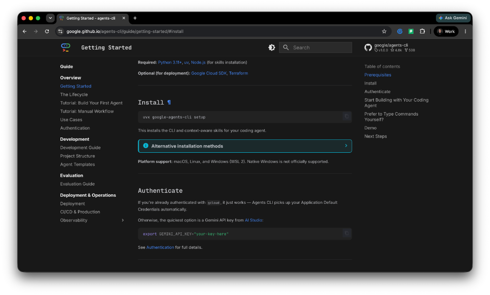

# Spec-Driven AI Agent Development: A Complete Training Curriculum
## Building Enterprise Agents with Google Antigravity, ADK 2.0, and Agents-CLI

---

## Module 1: Antigravity on Agent Platform

This module establishes the foundational environment. Gemini Antigravity acts as your interactive natural language developer surface (available as a full desktop app or a lightweight terminal TUI via the Antigravity CLI), while Google Cloud's Agent Platform provides the enterprise infrastructure.

### Google Cloud Project Setup
To orchestrate, validate, and track agent behavior, you must establish a secure connection to your Google Cloud infrastructure.

*   **Required API:** Enable the **Agent Platform API** (`agentplatform.googleapis.com`) in your Google Cloud Console project.
*   **Required IAM Roles:** Ensure your user account or service account possesses the following Identity and Access Management (IAM) permissions:
    *   `roles/agentplatform.admin` or `roles/agentplatform.developer`: Allows full creation, deployment, version management, and execution capabilities.
    *   `roles/aiplatform.user`: Grants permission to call underlying Vertex AI and Gemini models.
    *   `roles/logging.viewer` and `roles/monitoring.viewer`: Essential for downstream observability and log analysis.

### Workspace Initialization & Installation
Follow these steps to deploy and authenticate your environment:

1. **Download the Antigravity Application:**
   Navigate to the official Google Antigravity internal or distribution page. Download the appropriate binary bundle for your operating system:
   * **macOS:** Download the `.dmg` installer or execute via Homebrew if available in your enterprise tap: `brew install google-antigravity`.
   * **Windows:** Execute the `.msi` standalone executable installer or configure the binary in your local environment path.
   * **Linux:** Extract the `.tar.gz` binary distribution bundle and map the launcher to your shell path.

2. **Perform Agent Platform Login:**
   Launch Antigravity or execute the Antigravity CLI tool via your terminal terminal wrapper `/launch`. Complete the browser-based OAuth flow using your corporate or enterprise Google Cloud credentials. Once authorized, bind your local terminal context to your target cloud infrastructure:
   ```bash
   gcloud config set project YOUR_PROJECT_ID
   ```

---

## Module 2: The Google ADK 2.0 Framework Architecture

Before writing agent configuration code, you must understand the underlying framework. **Google ADK 2.0 (Agent Development Kit)** is an open-source, code-first Python framework explicitly built for multi-agent systems, structured execution graphs, and deterministic workflow routing.

### Source & Documentation Discovery
The source-of-truth repositories and structural patterns are maintained on Google's GitHub workspace:
*   **Core Repository:** `github.com/google/adk-python`
*   **Official Documentation Surface:** Full structural paths, code examples, and workflow specifications are hosted directly via the companion site `google.github.io/adk-docs/`.

### ADK 1.x vs ADK 2.0 Paradigm Shift
ADK 2.0 introduces breaking modular changes over 1.x, moving away from loose functional configurations into a rigid, graph-based execution engine.
* Key concepts focus on `Workflow` configurations and a definitive `Agent` schema.
* Structural multi-agent handoffs are handled through a native Task API instead of raw text parsing loops, ensuring that agent states can be serialized, resumed, and managed atomically.

---

## Module 3: Enterprise Lifecycle with Agents-CLI

While the developer's "inner loop" focuses on the local IDE and Antigravity workspace prompting (writing code, testing quick snippets), enterprise readiness demands a robust development and operational lifecycle. This handles multi-agent orchestration, continuous evaluation, deterministic building, zero-downtime deployments, and runtime observation at scale (the enterprise agentic harness).

### Repository & Multi-Environment Installation
The developer tooling patterns can be discovered at `github.com/google/agents-cli`. The Agents-CLI abstracts complex deployment targets into clean local workflows.



#### Step 1: Install Prerequisite Package Tooling
To ensure fast, isolated, and highly reproducible dependency structures, `agents-cli` utilizes `uv` as its primary underlying package manager.
* **macOS/Linux:**
  ```bash
  curl -LsSf https://astral.sh/uv/install.sh | sh
  ```
* **Windows:**
  ```powershell
  powershell -ExecutionPolicy ByPass -c "irm https://astral.sh/uv/install.ps1 | iex"
  ```

#### Step 2: Execute Global Setup
Do not install manually via standard global pip. Use `uvx` (the transient execution wrapper provided natively by `uv`) to download and configure the system layout:
```bash
uvx google-agents-cli setup
```
This setups the `agents-cli` binary globally, exposing specialized operational capabilities directly to your coding workspace.

#### Step 3: Verify Active Capabilities in Antigravity
Open your Antigravity panel or TUI and query your current environment capabilities to confirm proper registration:
```bash
agents-cli skills list
```
Verify that the following core agentic skills are marked active: `google-agents-cli-scaffold`, `google-agents-cli-workflow`, `google-agents-cli-eval`, and `google-agents-cli-deploy`.

---

## Module 4: Specification Driven Development

**Specification Driven Development (SDD)** is a software engineering paradigm that places structured specifications and AI agents at the core of the development lifecycle. Instead of using basic trial-and-error prompting (often called "prompt-and-patch"), SDD prioritizes meticulous requirement gathering, architectural design, and test planning. It borrows the design rigor of the traditional Waterfall model but integrates it into a modern, agile feedback loop. Human engineers act as system architects, writing high-fidelity specifications which the AI agents consume as a Single Source of Truth (SSOT) to generate and verify code.

### Writing the Agent Specification

To enable spec-driven development, you capture all design constraints, environment parameters, and tool logic in natural language before code generation occurs. 

> [!NOTE]
> The sample `plan.md` shown below is intentionally oversimplified for instructional purposes. In real-world enterprise applications, you should provide highly detailed system specifications or Product Requirement Documents (PRDs). The more detail and context you provide—including edge cases, strict input/output formats, and logical constraints—the more context the AI agent has to generate highly accurate code, minimizing iterations.

Create a file named `plan.md` in your root directory with this markdown structure:

```markdown
# Agent System Specification

## 1. App Configuration
- **App Name:** "app"

## 2. Agent Details
- **Agent Name:** "root_agent"
- **Base Model:** "gemini-3.5-flash"
- **Model Configurations:** 
  - Retry limit: 3 attempts
- **System Instruction:** "You are a helpful AI assistant designed to provide accurate and useful information."

## 3. Tools / Functions (ADK 2.0 Python format)
Equip the agent with these two custom tools:

### Tool 1: get_weather
- **Signature:** `get_weather(query: str) -> str`
- **Description:** Simulates a web search for weather info.
- **Logic:** If 'sf' or 'san francisco' is in the query case-insensitively, return "It's 60 degrees and foggy.", otherwise return "It's 90 degrees and sunny."

### Tool 2: get_current_time
- **Signature:** `get_current_time(query: str) -> str`
- **Description:** Simulates getting the current time for a city.
- **Logic:** If 'sf' or 'san francisco' is in the query case-insensitively, calculate the current time using the 'America/Los_Angeles' timezone and format it as '%Y-%m-%d %H:%M:%S %Z%z'. Otherwise, return "Sorry, I don't have timezone information for query: {query}."

## 4. Architecture Mapping
- Structure the generated Python output exactly following ADK 2.0 paradigms using the standard `from google.adk import Agent, App` structure.
- Map "root_agent" as the primary workflow component inside the "app" App wrapper.
```

---

## Module 5: Starting to Build Your AI Agent

With your configuration spec saved in `plan.md`, invoke the agent generation skill directly through Antigravity.

### The Workspace Prompt
Submit the following instruction to the Antigravity prompt interface:
```text
Build me the agent based on the specifications in plan.md
```

### The Internal Chain-of-Thought (CoT) Breakdown
Watch the Antigravity UI panel update in real-time as it parses the specification. It will activate `google-agents-cli-scaffold` and emit a structured execution sequence:
1. **Parsing `plan.md` Check:** Evaluates tool signatures, extract configurations, and target `gemini-3.5-flash`.
2. **Directory Creation:** Runs `agents-cli create app --prototype --yes` behind the scenes to build standard layouts.
3. **ADK Code Output Generation:** Automatically produces structural Python files (such as `main.py` or `agent.py`) implementing clean ADK 2.0 definitions (`Agent`, `App`).
4. **Dependency Management:** Installs local virtual environment packages using `agents-cli install` via `uv` to resolve dependencies cleanly.

---

## Module 6: Agent Playground

Before pushing code to cloud-hosted pipelines, test execution layouts locally using the Agent Playground. Instead of running commands in the terminal, you can ask Antigravity to start it for you.

### Prompting Antigravity
Submit the following prompt in the Antigravity chat:
```text
Run the agent playground
```
or:
```text
Start the local ADK playground for this project
```

Antigravity will execute the underlying command (`agents-cli playground run` or `adk web .` depending on your SDK layout) and launch the playground.

### The Local Interface
Open the link provided by Antigravity or navigate in your browser to `http://localhost:8000` (or the custom port printed in the execution logs).

### Graph Analysis & Execution Verification
* Use the web console to inspect the **Workflow Topology Graph**.
* Ensure that the incoming request routes cleanly through `App`, hooks into the `root_agent` component node, and maps conditional exit edges to your two local Python tools (`get_weather` and `get_current_time`).
* Send test queries like `"What is the weather in San Francisco?"` directly in the playground chat panel to verify operational trace routing and confirm that tool execution data streams back correctly.

---

## Module 7: Linting

Agent applications require rigorous validation of tool schemas, model parameters, and dependency graphs. Standard Python linters (like Ruff or Flake8) check for basic syntax or styling errors; an **Agent Linter** validates structural semantics. It ensures your tool docstrings match Python type signatures (crucial for accurate LLM function calling), verifies that model strings correspond to active Google GenAI endpoints, and checks that graph routing pathways do not contain dead ends or infinite loops.

### Linting via Antigravity
Instead of running command-line utilities, you can prompt Antigravity to run the linter and help you fix any issues:
```text
Run lint on this agent project
```
or:
```text
Check the agent structure and lint the code
```

Antigravity will run the validation suite (calling `agents-cli lint` in the background). If it encounters any errors (e.g., missing parameter descriptions in docstrings or invalid model endpoints), Antigravity will present them to you and can help automatically resolve them.

---

## Module 8: Agent Evaluations

Testing an agent requires more than just standard software unit assertions. You need to evaluate the open-ended behavioral quality of its responses using an automation harness.

### Navigating the Test Structure
The scaffold generated by `agents-cli` creates a dedicated evaluation subdirectory:
```text
tests/
└── eval/
    ├── eval_config.json      # LLM-as-a-Judge evaluation criteria definitions
    └── evalsets/
        └── root_agent.json   # Datasets containing input/gold-standard pairs
```

### Configuring Evaluation Criteria
Update `tests/eval/eval_config.json` to define your specific judgment metrics:
```json
{
  "metrics": [
    {
      "name": "temporal_accuracy",
      "definition": "Assess if the agent correctly extracts 'sf' or 'san francisco' and responds with the formatted timestamp containing PST/PDT indicators.",
      "grading_rubric": "Score 1-5 based on string format correctness (%Y-%m-%d %H:%M:%S %Z%z)."
    },
    {
      "name": "weather_tone_match",
      "definition": "Verify that the agent uses the literal simulated response mapping specified in the rules without hallucinating complex external forecasts.",
      "grading_rubric": "Score 1 or 0 based on matching exact phrases like 'foggy' or 'sunny'."
    }
  ]
}
```

### Running Evaluations via Antigravity
Instead of manually triggering evaluations via the terminal, prompt Antigravity to run the evaluation suite for you.

Submit one of the following prompts to Antigravity:
```text
Run agent evaluation
```
or:
```text
Evaluate the root_agent using the configured eval set
```

Antigravity will run the evaluations (under the hood calling `agents-cli eval run`), process the results, and present them directly inside the chat window.

The system will stream the execution of your test cases, displaying detailed metrics:
* **Process Output:** Displays the raw conversation logs alongside the evaluation metrics parsed by the judge model.
* **Results Analysis:** Outputs a final performance report containing your metric scores (0-5 or pass/fail distributions). This makes it easy to spot systemic issues—like broken tool parsing or misaligned prompt instructions—before deploying your code.

---

## Module 9: Cloud Deployment

Once your local evaluations pass, you are ready to deploy your agent application to Google Cloud. Depending on your organization's infrastructure and compliance needs, you can choose from multiple deployment targets:

1. **Agent Runtime:** A fully managed, secure runtime built specifically for ADK agents, providing built-in session persistence, trace logging, and Vertex AI integrations. *(Recommended)*
2. **Cloud Run:** Best for standard containerized deployments where you want custom scaling, HTTP entrypoints, and simple container configurations.
3. **Google Kubernetes Engine (GKE):** Ideal for large-scale enterprise deployments that require strict VPC orchestration, multi-tenant clustering, and integration with existing Kubernetes workloads.

### Sample Deployment to Agent Runtime
To deploy your agent, simply instruct Antigravity via a prompt. Antigravity will handle the packaging, containerization, and provisioning.

Submit the following prompt to Antigravity:
```text
Deploy this agent to Agent Runtime on Google Cloud
```

### Underlying Skill Activation
Antigravity intercepts this request and invokes the `google-agents-cli-deploy` skill. It:
1. Validates your project files and configuration.
2. Packages your Python virtual environment and dependencies.
3. Compiles the deployment manifest pointing to your target cloud environment.
4. Uploads and initializes the workspace on the Google Cloud Agent Runtime.

### Why Deploy to Agent Runtime on Google Cloud?
Google Cloud's Agent Runtime provides a fully managed, enterprise-secure execution environment. It handles:
* Automatic scaling and zero-downtime version rolling.
* Strict isolation via VPC Service Controls and secure sandbox environments.
* Built-in session state persistence for long-running user conversations.

### Production Observation & Monitoring
Once live, you monitor your agent directly through the Google Cloud Console:
* **Cloud Trace:** Tracks individual model calls, tool latencies, and inner function call durations via integrated OpenTelemetry.
* **Cloud Logging:** Captures structural execution payloads and debug events.
* **Cloud Monitoring:** Displays live dashboards monitoring token consumption, request error rates, and total invocation counts.

---

## Module 10: Enterprise App Registration

The final phase makes your newly deployed agent available to end users across your business.

### The Registration Prompt
Submit the final orchestration instruction to your interface:
```text
Register the deployed agent in our Gemini Enterprise App hub
```

### Execution Mechanics
Antigravity reads the deployed production endpoint metadata from your cloud project environment. Using your active skills, it interacts with the Gemini Enterprise administrative gateway, registers the live agent endpoint as an authorized tool or sub-agent plugin, and updates the application routing topology.

### The Operational Outcome
Your custom agent is now securely accessible within your organization's enterprise ecosystem. It stands ready to handle end-user requests, process data through its specialized tools, and safely delegate tasks within your broader business workflows.